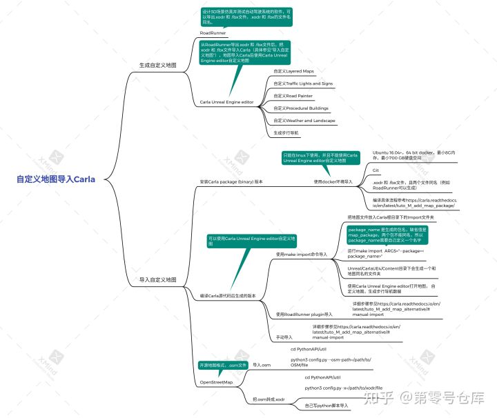

tags:: #毕业设计

-
- # 需求
  为了提高 SLAM 算法的调试和效率，通常需要借助仿真平台，搭建实验所需的虚拟环境，对算法进行高效仿真模拟和测试。本课题的研究场景为大范围的动态城市环境，需要具备真实交通场景的建模、以及传感器模型、机器人动力学模型。
- # 对比选择
  通过网络查询资料，如图 2-1 所示，对比分析了开源的的自动驾驶仿真软件平台，结合优缺点综合考虑，最终选定基于 Carla 平台搭建需要的仿真场景。
  
- # 介绍
  Carla 是一款基于 Unreal Engine 4 开发的自动驾驶开源仿真平台，用于城市自动驾驶系统的开发、训练和验证的开源模拟器。Carla 支持多种传感模式和环境条件的灵活配置，不仅支持多摄像头，激光雷达，GPS 等传感器，也可以调节环境的光照和天气。Carla 提供为自动驾驶创建的开源数字资源，支持车辆和行人的自动行为模拟，同时提供 Python 接口，方便对场景中的车辆，信号灯等进行控制，为仿真环境的构建提供了便利。同时，Carla 也支持与 ROS 系统联合运行，通过安装调用 ROS Bridge 包可以实现两个平台之间的交互，方便在 ROS 平台编写代码。为此，本课题采用 Carla 实现动态城市环境的搭建。
- # 使用
  本文利用 Carla 平台提供的开源地图和插件，设计了本课题所需要的动态城市环境，如图 2-2 所示。该虚拟环境呈现了大范围的城市场景，并为其设置了 30 辆交通工具和 6 位行人,能够自动在环境中移动。该环境能够设置多种天气和光照条件，可以通过按键调节环境。如图 2-3 所示，本文通过调用 ROS Bridge 包实现了Carla 平台与 ROS 平台之间的交互，能够在 Rviz 上显示汽车的里程信息和实时激光雷达点云数据。
  
  
- TODO # 安装与使用
- # 术语
	- **world**：一个仿真对象，包括actor生成，改变天气，取得world state等。每次仿真只有一个world，当更换地图时，当前world会被销毁，再重新生成一个world。
	- **actor**：仿真中的任一角色，例如：车，人，传感器，交通标志，交通灯。
	- **blueprint**：蓝图，生成actor的actor layout，这些actor有自己的属性，有的属性可以修改，有的属性不能修改。Blueprint library包含了所有blueprint。
	- **maps**：仿真使用的地图。carla有8个地图，地图采用OpenDRIVE1.4格式。8个地图如下：
		- Town01: T junctions
		- Town02: 和Town01类似，更小一些
		- Town03：最复杂的Town，包括junction，roundabout，tunnel等
		- Town04：高速和小镇
		- Town05：交叉路口和桥，多个lane，可以用来做车道变线测试。
		- Town06：带有出入口的长高速路
		- Town07：狭窄路
		- Town10：林荫道，步行大道
	- **sensor**：sensor可以附加到车上，从仿真环境中收集数据。sensor包括如下类型：
		- Cameras (RGB, depth and semantic segmentation).
		- RGB相机（普通摄像头），深度相机，语义分割相机
		- Collision detector.碰撞检测
		- Gnss sensor. 全球卫星定位
		- IMU sensor. 惯性传感器
		- Lidar raycast. 激光雷达
		- Lane invasion detector. 压线检测
		- Obstacle detector. 障碍物检测
		- Radar. 毫米波雷达 RSS.
		- 责任敏感安全传感器
	- **OpenDRIVE standalone mode**： 用OpenDRIVE文件生成路网，不需要在carla中创建assets就可以加载OpenDRIVE地图。
	- **PTV-Vissim co-simulation**： PTV-Vissim 是一款traffic仿真软件。carla支持和 PTV-Vissim同步仿真。
	- **SUMO co-simulation**： SUMO 是一款traffic仿真软件。carla支持和 SUMO 同步仿真。
	- **Recorder**：回放 ，跟踪工具。所有数据写到一个在server端的二进制文件。
	- **Rendering options**：渲染选项。分三种：Graphics quality settings, off-screen rendering , a no-rendering mode
	- **Traffic manager**:控制车辆，仿真市区交通环境。
- # 使用
	- ## 控制
		- ```sh
		  python manual_control.py
		  ```
		- ### 按键
			- W : 前进。↑键也可以前进。
			- S : 刹车。↓ 键也可以 刹车
			- A/D : A左转 D右转。←也可以左转，→也可以右转。
			- Q : Q倒车标志。Q+W可以倒车。
			- Space : 空格是手刹。和S不同。
			- P : 开启/关闭自动驾驶模式。
			- M : 切换到手动模式。
			- ,/. : 加减挡。，减档 . 加档
			- CTRL + W : 同时按下 CTRL + W ，在放开CTRL + W ，车会一直以60 km/h的速度前进
			- L : 控制车灯切换。雾灯、近光灯等切换。
			- SHIFT + L : 切换远光灯
			- Z/X : 转向灯。Z左转向，X右转向。
			- I : 车内照明灯。
			- TAB : 切换视角
			- ` or N : 切换不同类型的camera和lidar
			- [1-9] : 切换不同类型的camera和lidar，和N不同，N每按下一次，sensor顺序切换。按下数字键，可直接切换到对应sensor
			- G : toggle radar visualization
			- C : 切换天气，(Shift+C ，天气有多种，切换顺序和C相反)
			- Backspace : 换车型
			- V : 选地图图层 (Shift+V ，地图有多个图层，切换顺序和V 相反)
			- B : 加载当前的地图图层(Shift+B 卸载当前的地图图层)
			- R : 时时记录车辆走行情况
			- CTRL + R : 切换到 R做的记录 (replacing any previous)
			- CTRL + P : 回放R的记录
			- CTRL + + : increments the start time of the replay by 1 second (+SHIFT = 10 seconds)
			  CTRL + - : decrements the start time of the replay by 1 second (+SHIFT = 10 seconds)
			- F1 : 显示/不显示页面左侧和sensor相关的一些信息，例如加速度，陀螺仪，GNSS等
			- H/? : H和？可以弹出帮助命令
			- ESC : 退出pygame
	- ## 地图
		- 
		-
- 参考文章
	- [自动驾驶模拟器Carla简介及功能说明（一）](https://zhuanlan.zhihu.com/p/475193556)