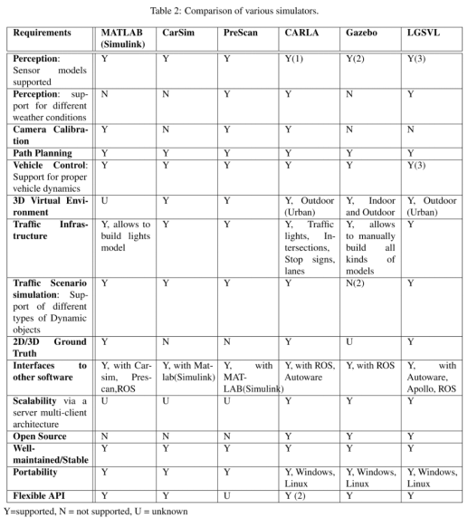
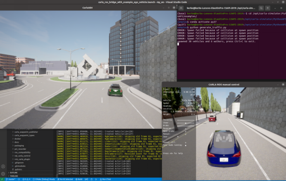
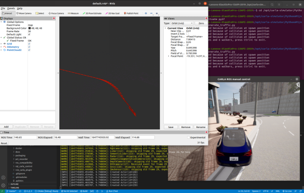

tags:: #毕业设计

-
- # 需求
  为了提高 SLAM 算法的调试和效率，通常需要借助仿真平台，搭建实验所需的虚拟环境，对算法进行高效仿真模拟和测试。本课题的研究场景为大范围的动态城市环境，需要具备真实交通场景的建模、以及传感器模型、机器人动力学模型。
- # 对比选择
  通过网络查询资料，如图 2-1 所示，对比分析了开源的的自动驾驶仿真软件平台，结合优缺点综合考虑，最终选定基于 Carla 平台搭建需要的仿真场景。
  
- # 介绍
  Carla 是一款基于 Unreal Engine 4 开发的自动驾驶开源仿真平台，用于城市自动驾驶系统的开发、训练和验证的开源模拟器。Carla 支持多种传感模式和环境条件的灵活配置，不仅支持多摄像头，激光雷达，GPS 等传感器，也可以调节环境的光照和天气。Carla 提供为自动驾驶创建的开源数字资源，支持车辆和行人的自动行为模拟，同时提供 Python 接口，方便对场景中的车辆，信号灯等进行控制，为仿真环境的构建提供了便利。同时，Carla 也支持与 ROS 系统联合运行，通过安装调用 ROS Bridge 包可以实现两个平台之间的交互，方便在 ROS 平台编写代码。为此，本课题采用 Carla 实现动态城市环境的搭建。
- # 使用
  本文利用 Carla 平台提供的开源地图和插件，设计了本课题所需要的动态城市环境，如图 2-2 所示。该虚拟环境呈现了大范围的城市场景，并为其设置了 30 辆交通工具和 6 位行人,能够自动在环境中移动。该环境能够设置多种天气和光照条件，可以通过按键调节环境。如图 2-3 所示，本文通过调用 ROS Bridge 包实现了Carla 平台与 ROS 平台之间的交互，能够在 Rviz 上显示汽车的里程信息和实时激光雷达点云数据。
  
  
- TODO # 安装与使用