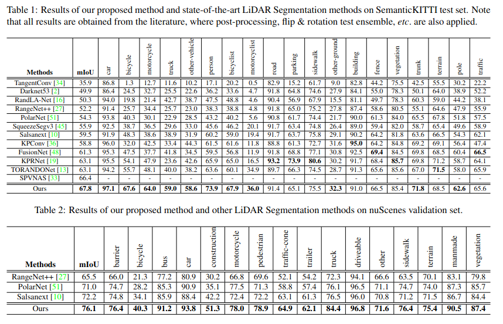

tags:: #毕业设计

- # 环境配置
	- # 平台
		- Ubuntu20.04
		- ROS
		-
		- **LeGO-LOAM**
			- [gtsam](https://github.com/borglab/gtsam/releases) (Georgia Tech Smoothing and Mapping library, 4.0.0-alpha2)
			  ```bash
			  wget -O ~/Downloads/gtsam.zip https://github.com/borglab/gtsam/archive/4.0.0-alpha2.zip
			  cd ~/Downloads/ && unzip gtsam.zip -d ~/Downloads/
			  cd ~/Downloads/gtsam-4.0.0-alpha2/
			  mkdir build && cd build
			  cmake ..
			  sudo make install
			  ```
		- **Pytorch**
		  ```sh
		  conda create -n pytorch python=3.8  
		  conda install pytorch torchvision torchaudio cpuonly -c pytorch
		  ```
- # 框架
  [[LeGO-LOAM]] 特征匹配
  
  
  
  Cylinder3D 语义分析寻找动态物体
	- ### 语义分析网络
		- #### SuMa++: LiDAR-based Semantic SLAM
		  通过rangeNet++网络为每一帧的每个点云生成一个语义标签以及概率，得到语义地图，用洪水填充算法进行优化
		  
		  **测试结果**
		  average rotational error ： 0.0032 deg/m
		  average translational error ： 1.06%
		  
		  项目的README.md中提到：
		  > SuMa++ now can only work with KITTI dataset, since the semantic segmentation may not generalize well in other environments.To use SuMa++ with your own dataset, you may finetune or retrain the semantic segmentation network.
		- #### Cylindrical and Asymmetrical 3D Convolution Networks for LiDAR Segmentation
		- #### 比较
		  
		  Compared to the projection-based methods on 2D space, including Darknet53 [2], SqueezeSegv3 [45], RangeNet++ [27] and PolarNet [51], our method achieves 8% ∼ 17% performance gain in term of mIoU due to the modeling of 3D geometric information.
		  与基于投影的 2D 空间方法相比，包括 Darknet53 [2]、SqueezeSegv3 [45]、RangeNet++ [27] 和 PolarNet [51]，由于建模，我们的方法在 mIoU 方面实现了 8% ∼ 17% 的性能增益 3D 几何信息。
		   
		  考虑到本课题