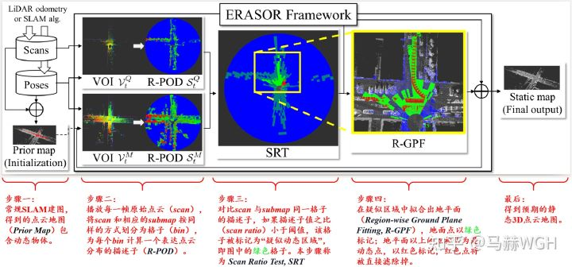
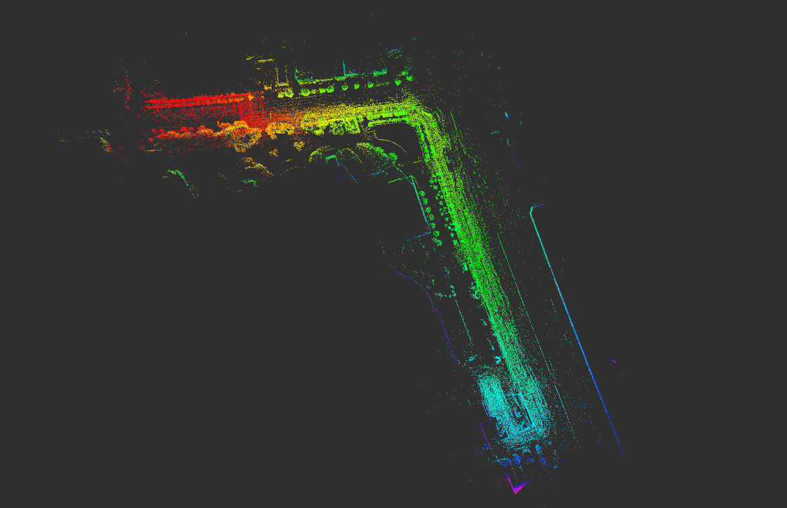

tags:: #毕业设计

- # 介绍
  id:: 626be7b6-d431-4d8f-9976-6d614e62b158
  ERASOR算法是在SLAM构建好点云地图后，基于栅格占据情况之差异对地图进行一遍后处理，以达到滤除动态物体的目的。
- # 算法框架
  id:: 5cfe4e90-3523-4909-8d3c-c965471b79c2
  
- # 算法流程
  id:: 626c8fb5-f3ca-4b44-a9f2-87cd3d87f7ff
	- 根据官方文档的运行步骤，可以看出第一部是用来构建静态地图的，这一部我们用 [[LeGO-LOAM]] 算法替代，而用于滤除动态物体的ERASOR算法是通过`run_erasor.launch`执行的，因此只需要阅读这部分相关代码即可
	- ## 启动
		- 启动文件：`run_erasor.launch`
		- 启动节点
			- `offline_map_updater`
			- `rviz`
			- `rviz_body`
	- ## 核心程序
		- main_kitti
		  创建一个离线地图更新程序
		- OfflineMapUpdater
			- 回调函数
				- `callback_node`
					- 订阅话题
						- `/node/combined/optimized`:点云数据
						- `/saveflag`:保存标志
					-
			-
- # 测试运行
  id:: 626be8eb-c669-489a-9714-609894f82e70
	- ## 官方文档-KITTI数据集
	  We will explain how to run our code on seq 05 of the KITTI dataset as an example.
	  
	  **Step 1. Build naive map**
	   
	  
	  * Set the following parameters in `launch/mapgen.launch`.
	  	* `target_rosbag`: The name of target rosbag, e.g. `05_2350_to_2670_w_interval_2_node.bag`
	  	* `save_path`: The path where the naively accumulated map is saved.
	  * Launch mapgen.launch and play corresponding rosbag on the other bash as follows:
	  ```bash
	  roscore # (Optional)
	  roslaunch erasor mapgen.launch
	  rosbag play 05_2350_to_2670_w_interval_2_node.bag
	  ```
	  * Then, dense map and voxelized map are auto-saved at the `save path`. Note that the dense map is used for evaluation to fill corresponding labels. The voxelized map will be an input of step 2 as a naively accumulated map.
	  
	  **Step 2. Run ERASOR**
	   
	  * Set the following parameters in `config/seq_05.yaml`.
	  	* `initial_map_path`: The path of naively accumulated map
	  	* `save_path`: The path where the filtered static map is saved.
	  
	  * Run the following command for each bash.
	  ```bash
	  roscore # (Optional)
	  roslaunch erasor run_erasor.launch target_seq:="05"
	  rosbag play 05_2350_to_2670_w_interval_2_node.bag
	  ```
	- ## 官方文档-自己的数据集
		- ### In your own dataset
		  
		  To check generalization of ERASOR, we tested ERASOR in more crowded environments. In that experiment, Velodyne Puck 16 was employed, and poses are estimated by [LIO-SAM](https://github.com/TixiaoShan/LIO-SAM).
		  |*Satellite map*|*Pcd map by LIO-SAM*|
		  |||
		  When **running ERASOR in your own environments**, please refer to `src/offline_map_updater/main_in_your_env.cpp` file and `launch/run_erasor_in_your_env_vel16.launch`.
		  
		  You can learn how to set experimental setting by repeating our pre-set configurations. Please follow our instructions.
		  
		  * First, download pre-set dataset.
		  ```
		  wget https://urserver.kaist.ac.kr/publicdata/erasor/bongeunsa_dataset.zip
		  unzip bongeunsa_dataset.zip
		  ```
		  
		  * Modify `data_dir`, `MapUpdater/initial_map_path`, and `MapUpdater/save_path` in `config/your_own_env_vel16.yaml` to be right directory for your machine, where `data_dir` should consist of following components as follows:
		  
		  ```
		  `data_dir`
		  _____pcds
		     |___000000.pcd
		     |___000001.pcd
		     |___000002.pcd
		     |...
		  _____dense_global_map.pcd
		  _____poses_lidar2body.csv
		  _____...
		  ```
		  
		  * Next, launch `launch/run_erasor_in_your_env_vel16.launch` as follows:
		  
		  
		  ```
		  roslaunch erasor run_erasor_in_your_env_vel16.launch
		  ```
		- ### Results
		  
		   
		  
		- ### Note: Setting appropriate parameters
		  
		  * As shown in `config`, depending on your own sensor configuration, parameters must be changed. In particular, `min_h` and `max_h`, and `th_bin_max_h` should be changed (note that `min_h` and `max_h`, and `th_bin_max_h` is w.r.t. your body frame of a query pcd file.) 
		  * If you use a low-channel LiDAR sensor such as Velodyne Puck-16, `max_r` and `num_rings` must be set as smaller values like `config/your_own_env_vel16.yaml` to guarantee the estimated normal vector for each bin is considered to be orthogonal to the ground.
		  * If too many points are considered as ground points for each bin, then reduce the value of `gf_dist_thr`.
	- ## 注意事项
	  一般来说直接按照上述步骤运行即可。
	  但是在运行过程中出现以下问题 
	  那么需要将`run_erasor.launch`进行修改，删去数字前的0
	  ```xml
	  <arg name="target_seq" default="5"/>
	  <group if="$(eval arg('target_seq') ==0)">
	      <rosparam command="load" file="$(find erasor)/config/seq_00.yaml" />
	  </group>
	  <group if="$(eval arg('target_seq') ==1)">
	      <rosparam command="load" file="$(find erasor)/config/seq_01.yaml" />
	  </group>
	  <group if="$(eval arg('target_seq') ==2)">
	      <rosparam command="load" file="$(find erasor)/config/seq_02.yaml" />
	  </group>
	  <group if="$(eval arg('target_seq') ==5)">
	      <rosparam command="load" file="$(find erasor)/config/seq_05.yaml" />
	  </group>
	  <group if="$(eval arg('target_seq') ==7)">
	      <rosparam command="load" file="$(find erasor)/config/seq_07.yaml" />
	  </group>
	  ```