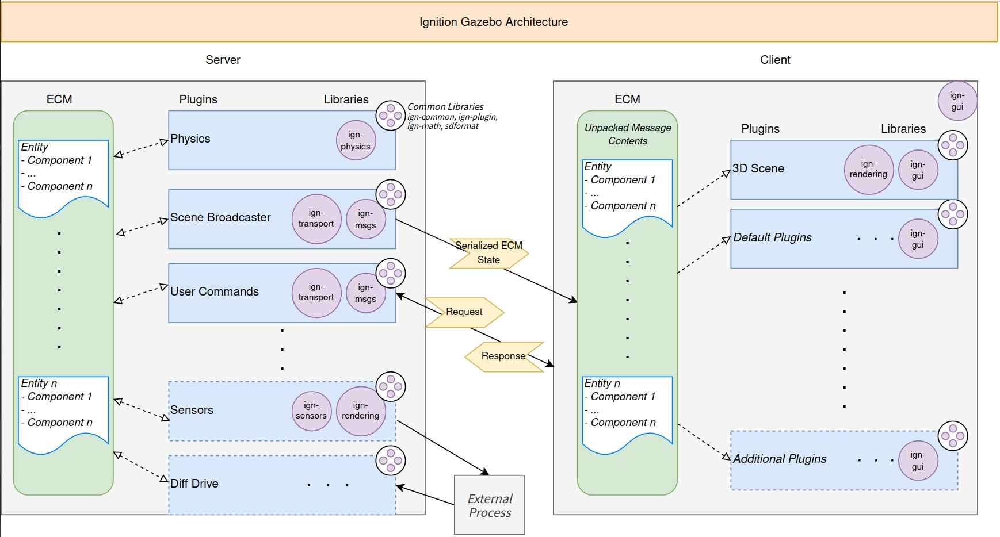

- 
- # Common
	- Ignition Common : AV, Graphics, Events, and much more.
	- Ignition Common, a component of Ignition Robotics, provides a set of libraries that cover many different use cases. An audio-visual library supports processing audio and video files, a graphics library can load a variety 3D mesh file formats into a generic in-memory representation, and the core library of Ignition Common contains functionality that spans Base64 encoding/decoding to thread pools.
- # Rendering
	- 机器人应用程序的渲染库
	- Ignition Rendering 是一个 C++ 库，旨在为不同的渲染引擎提供抽象。 它提供了用于创建 3D 图形应用程序的统一 API。
	- 点火渲染是点火框架中的一个组件，它是一组旨在快速开发机器人应用程序的库。