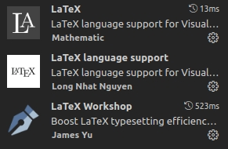
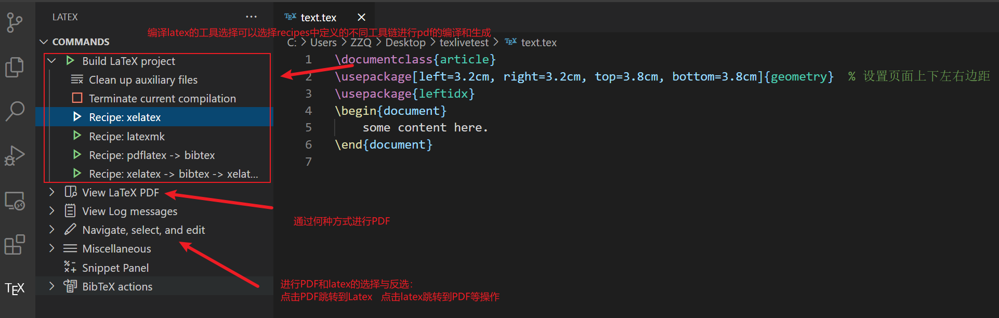

tags:: #工具

- # 教程
- # 使用
	- ## Texlive
		- ```bash
		  sudo apt install texlive-full
		  ```
		- 写入环境变量`.bashrc`
			- ```sh
			  export PATH=/usr/local/texlive/2019/bin/x86_64-linux:$PATH
			  export MANPATH=/usr/local/texlive/2019/texmf-dist/doc/man:$MANPATH
			  export INFOPATH=/usr/local/texlive/2019/texmf-dist/doc/info:$INFOPATH
			  ```
	- ## 编辑器
		- ### TexStudio
			- **安装**
				- ```shell
				  sudo apt-get install texstudio
				  ```
		- ### VsCode
			- **插件**
				- 
				- 打开用户设置代码片段设置->右上角Open Setting(JSON)->settings.json
				  collapsed:: true
					- ```json
					  {
					      "latex-workshop.latex.tools": [
					          {
					            "name": "latexmk",
					            "command": "latexmk",
					            "args": [
					            "-synctex=1",
					            "-interaction=nonstopmode",
					            "-file-line-error",
					            "-pdf",
					            "%DOCFILE%"
					            ]
					          },
					          {
					            "name": "xelatex",
					            "command": "xelatex",
					            "args": [
					            "-synctex=1",
					            "-interaction=nonstopmode",
					            "-file-line-error",
					            "%DOCFILE%"
					              ]
					          },          
					          {
					            "name": "pdflatex",
					            "command": "pdflatex",
					            "args": [
					            "-synctex=1",
					            "-interaction=nonstopmode",
					            "-file-line-error",
					            "%DOCFILE%"
					            ]
					          },
					          {
					            "name": "bibtex",
					            "command": "bibtex",
					            "args": [
					            "%DOCFILE%"
					            ]
					          }
					        ],
					        
					        "latex-workshop.latex.recipes": [
					        
					            {
					                "name": "XeLaTeX",
					                "tools": [
					                    "xelatex"
					                ]
					            },
					            {
					                "name": "PDFLaTeX",
					                "tools": [
					                    "pdflatex"
					                ]
					            },
					            {
					                "name": "BibTeX",
					                "tools": [
					                    "bibtex"
					                ]
					            },
					            {
					                "name": "LaTeXmk",
					                "tools": [
					                    "latexmk"
					                ]
					            },
					            {
					                "name": "xelatex -> bibtex -> xelatex*2",
					                "tools": [
					                    "xelatex",
					                    "bibtex",
					                    "xelatex",
					                    "xelatex"
					                ]
					            },
					            {
					                "name": "pdflatex -> bibtex -> pdflatex*2",
					                "tools": [
					                    "pdflatex",
					                    "bibtex",
					                    "pdflatex",
					                    "pdflatex"
					                ]
					            }
					        ]
					  }
					  ```
				- 
			- 参考文章
				- [Ubuntu20.04下 VsCode + LaTeX 的使用](https://zhuanlan.zhihu.com/p/451420916)