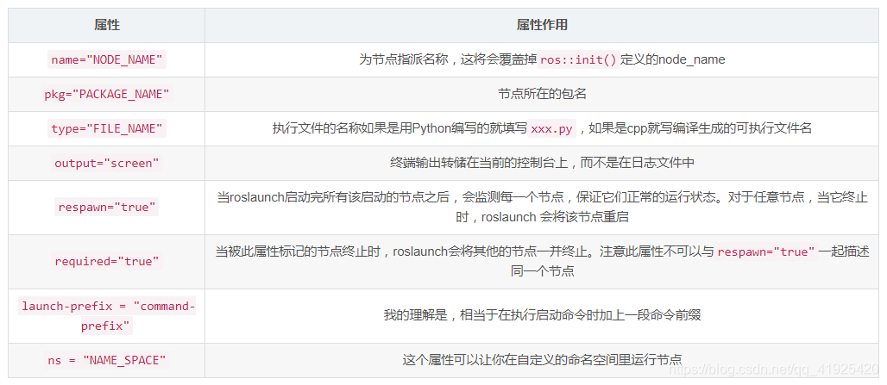

tags:: #ROS

	- # 介绍
		- 用于自动启动ros节点的命令行工具
	- # 标签
		- ## <node>
			- 用于指定 ROS 节点
			- 节点的启动是多线程的
			- {:height 306, :width 686}
		- ## <include>
			- 导入另一个roslaunch XML文件到当前文件
			- ```xml
			  <include file="$(find demo)/launch/demo.launch" ns="demo_namespace"/>
			  ```
		- ## <remap>
			- 重映射
		- ## <param>
			- 设置一个参数在参数服务器上
		- ## <arg>
			- 声明一个参数
		- ## <rosparam>
			- 加载文件中的多个参数
		- ## <group>
			- 将共享名称空间或重新映射的封闭元素分组