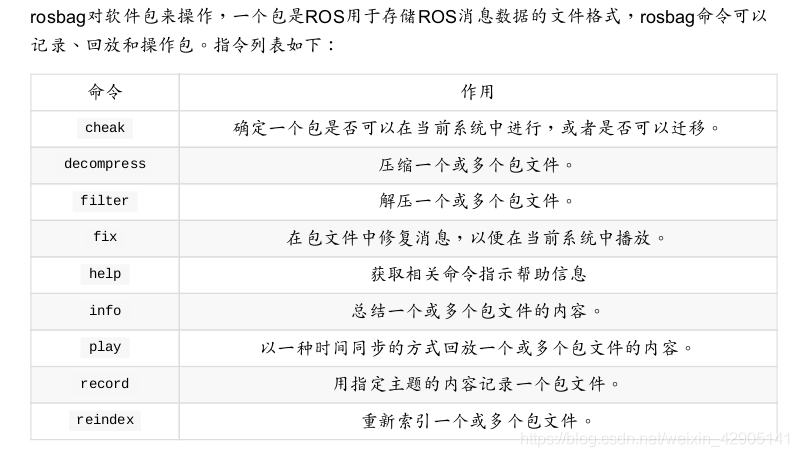

tags:: #ROS

- # rosbag介绍
	- rosbag 主要用于记录、回放、分析 rostopic 中的数据。它可以将指定 rostopic 中的数据记录到 .bag 后缀的数据包中，便于对其中的数据进行离线分析和处理。
	  对于 subscribe 某个 topic 的节点来说，它无法区分这个 topic 中的数据到底是实时获取的数据还是从 rosbag 中回放的数据。这就有助于我们基于离线数据快速重现曾经的实际场景，进行可重复、低成本的分析和调试。
	- 
- # 使用
	- ## 录制数据包
		- 用于在ros系统中录取系统中其他ros节点发出来的topic的message.
		- ### 命令行
			- ```bash
			  rosbag record  a # 录制所有发布的话题 默认将话题保存在一个以当时时间戳命名的文件夹中
			  rosbag record /topic1 /topic2 -o out.bag #录制指定话题
			  ```
			- 会自动的在你的文件名称后加上当前的时间戳
			  ```shell
			  rosbag record -o xxx.bag topic-name # 加上当前的时间戳
			  rosbag record -O xxx.bag topic-name # 不加
			  ```
		- ### roslaunch
			- 每次录制结果不会覆盖
			- ```xml
			  <node pkg="rosbag" type="record" name="bag_record" args="topic-name1 topic-name1 -o xxxx“/>
			  ```
	- ## 回放话题
		- ### 命令行
			- ```
			  rosbag play <your bagfile name> # 基本功能
			  rosbag play <your bagfile name> -d <delay time> # 等待一定时间之后发布bag文件中的内容
			  rosbag play -r 3 <your bagfile name> # 按一定频率回放，-r选项用来设定消息发布速率，如下面命令则表示以3倍原始速率发布话题
			  rosbag play <your bagfile name> --topics <topics> # 回放指定话题
			  rosbag info <your bagfile name> # 显示bag文件中所包含话题的名称、类型和消息数量
			  ```
- 参考文章
	- [ROS——一文读懂：rosbag](https://blog.csdn.net/weixin_42905141/article/details/100057323)