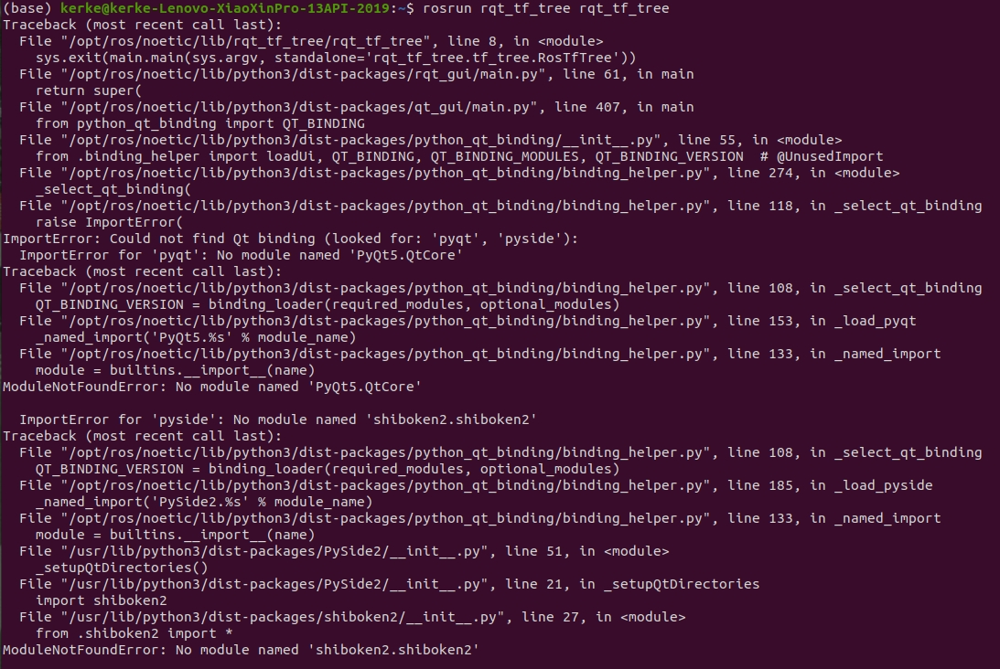

tags:: #ROS

- roscore cannot run as another roscore/master is already running. Please kill other roscore/master
	- 明明已经关闭了所有终端，但是重新打开终端运行roscore的时候提示以上错误
	- 解决办法是在终端中输入:
		- ```bash
		  killall -9 roscore
		  killall -9 rosmaster
		  ```
	-
- ros运行`rosrun rqt_tf_tree rqt_tf_tree`出错
  id:: 627d0cc3-b645-4ab2-94d4-9a3c0d4116a7
	- 
	- 发现PySide2导入有问题，是shiboken2的问题，但搜索资料没法找到解决方法
	- 替代方法
		- 用`rqt`命令打开`rqt_tf_tree`