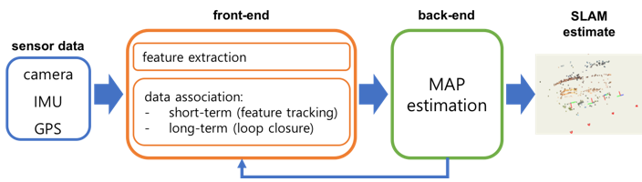

tags:: #技术

- SLAM (Simultaneous Localization and Mapping) 是一种通过自身传感器对未知环境进行感知、建图并完成自身定位的技术。在建图和定位的过程中主要使用激光雷达和相机等传感器感知外界环境，以及陀螺仪、编码器等传感器感知自身运动。其中基于激光雷达的 SLAM 技术由于其精度高、建图直观、技术成熟等优点备受瞩目，是目前最稳定、最主流的定位导航方法。
- # 框架
	- 
	- ## 前端
		- 进行特征提取，获取相邻帧的位姿变换
	- ## 后端
		- 进行地图的拼接和位姿优化。