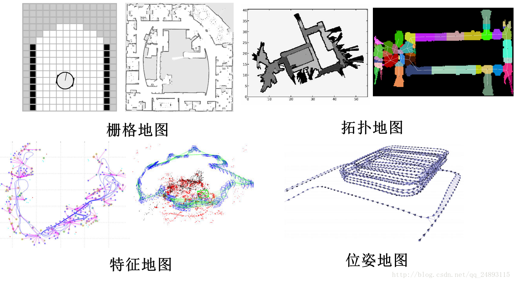
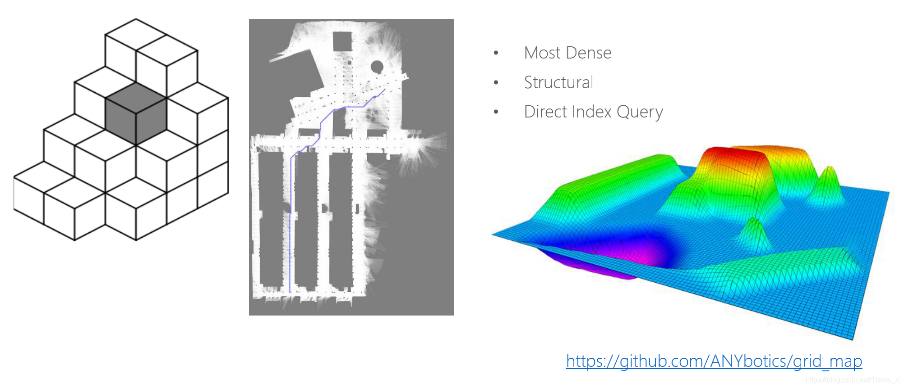
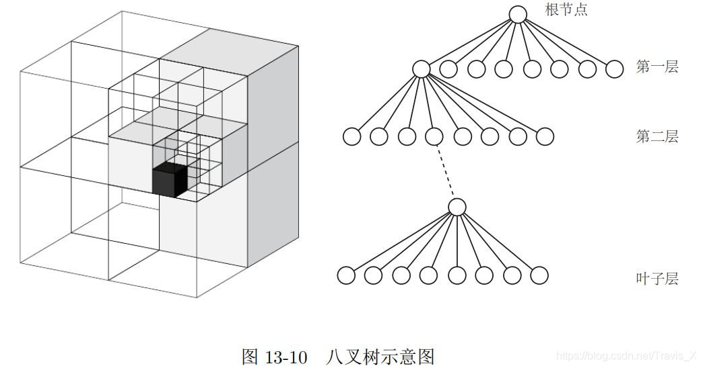
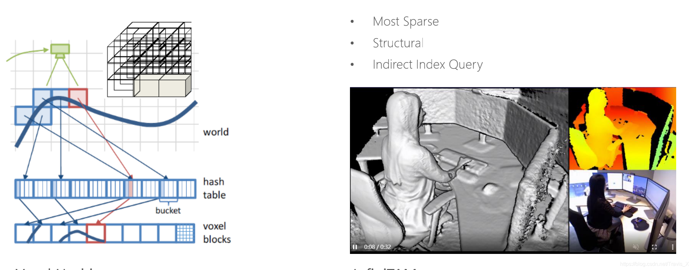

tags:: #SLAM

- 
- # 点云地图(Point cloud map)
	- ## 特征点云地图
		- 图数据是一个无序的，没有办法直接进行索引查询，必须用PCL库进行处理
- # 语义地图
- # 障碍物占据地图
	- ## 占据栅格地图
		- 用数组结构的方法进行地图障碍物数据存储
		-  
		  id:: 627baecd-9780-4d11-8cf0-eb935cc233aa
		- 非常稠密（消耗大量内存）、结构化、可以直接进行索引查询（O(1)）
			- [【地图】二维占据栅格地图生成方法及源码解析](https://blog.csdn.net/qq_35635374/article/details/120918847)
	- ## 八叉树地图(Octomap)
	  collapsed:: true
		- **原理**
			- 将三维空间建模分割成许多的小方块，如果将每个小方块的每个面切成两片，那么这个小方块就会变成同样大小的八个小方块。将该步骤不断重复，直到最后的方块大小达到建模的最高精度。在该过程中，将＂从一个节点展开成八个子节点＂，那么，整个空间从最大空间细分到最小空间的过程，就是一棵八叉树。
			- 
		- **优点**
			- 可以用于导航
			- 每个节点概率占据
		- **构建**
			- 开源工具
			  http://wiki.ros.org/octomap_server
			- 生成地图的工具
			  https://octomap.github.io/
			  https://github.com/OctoMap/octomap
			  http://wiki.ros.org/octomap
			  https://blog.csdn.net/LOVE1055259415/article/details/79911653
			  https://www.bilibili.com/video/BV17w411R7Ca?spm_id_from=333.999.0.0
			  https://blog.csdn.net/Travis_X/article/details/89305574
			- [转换pcd到octomap](https://github.com/gaoxiang12/octomap_tutor)
	- ## 体素哈希地图(voxel hashing)
	  collapsed:: true
		- 通过二重哈希表来存储障碍物边界的每个voxel（单元栅格）
		- 
		-
		- https://github.com/niessner/VoxelHashing
- # 代价地图(costmap)
	- navigation功能包
	- [【地图】costmap_2d代价地图生成原理](https://blog.csdn.net/qq_35635374/article/details/120874817#t5)
- # TSDF地图(Truncated Signed Distance Functions)
	- https://github.com/personalrobotics/OpenChisel
- # ESDF 地图(Euclidean Signed Distance Functions)
	- https://github.com/ethz-asl/voxblox
	- https://github.com/HKUST-Aerial-Robotics/FIESTA 性能比voxblox更好
- # 韦诺数字地图(Voronoi Diagram Map)
	- 利用ESDF提取地图的骨架–拓扑结构
	- 适合超大规模的路径规划
	- https://github.com/ethz-asl/mav_voxblox_planning
- # 自由空间的概率路线图(Free-space Roadmap)
	- 随机采样的概率路线图，用凸多面体来表示路径点，再进行连接
- 参考文章
	- [slam建图与八叉树地图](https://blog.csdn.net/weixin_39568744/article/details/88648694)
	- [【地图mapping】（1）地图的理解及地图的类型介绍【重要】](https://blog.csdn.net/qq_35635374/article/details/120960481#t3)
	- [[地图]常用的地图结构](https://blog.csdn.net/Travis_X/article/details/114241945)
	- [SLAM学习笔记-地图类型](https://blog.csdn.net/weixin_51244852/article/details/116865811)