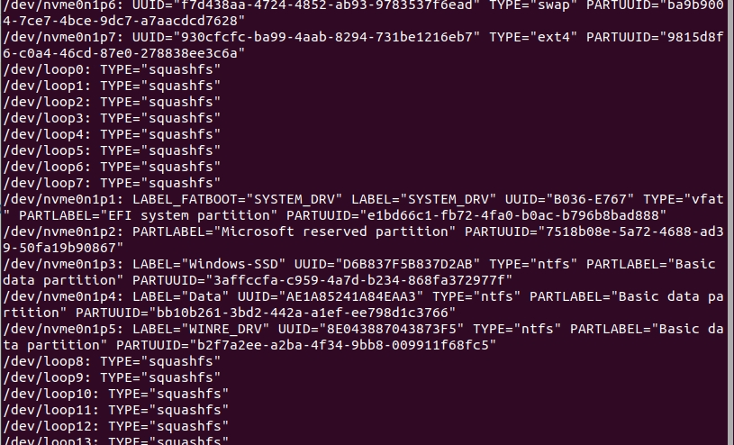

title:: ubuntu20.04设置开机自动挂载磁盘
tags:: #教程

- # 需求
  自动挂载window的D盘，方便双系统之间文件共享另一块硬盘挂载上
- # 步骤
	- 先看一下目标磁盘分区的uuid
	  ```bash
	  sudo blkid
	  ```
	  
	  由上图可以看到，我们要挂载的磁盘Data的uuid和type
	- 编辑/etc/fstab 文件
	  ```bash
	  sudo gedit /etc/fstab
	  ```
	  写入
	  ```
	  #格式：<fs spec> <fs file> <fs vfstype> <fs mntops> <fs freq> <fs passno>
	  #解释：
	  #<fs spec>：分区定位，可以给UUID或LABEL，例如：UUID=6E9ADAC29ADA85CD或LABEL=software
	  #<fs file>：具体挂载点的位置，例如：/mnt/d
	  #<fs vfstype>：挂载磁盘类型,linux 分区一般为 ext4，windows 分区一般为 ntfs
	  #<fs mntops>：挂载参数，一般为defaults
	  #<fs freq>：磁盘备份，默认为0，不备份
	  #<fs passno>：磁盘检查，默认为0，不检查
	  UUID=AE1A85241A84EAA3 /home/kerke/data        ntfs    defaults              0       1
	  ```
	- 重新启动