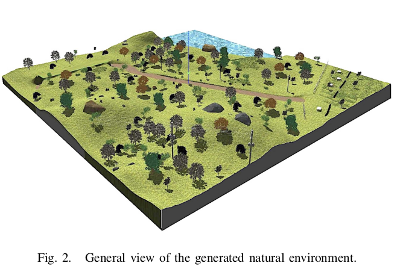
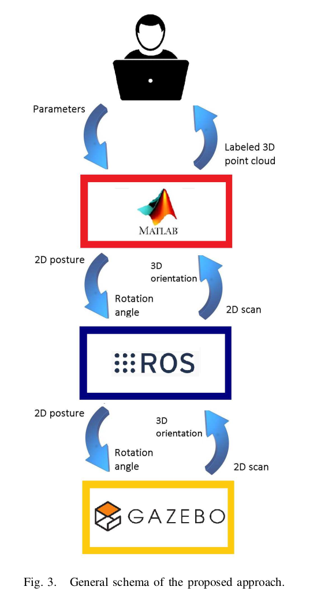

title:: 【论文阅读】Automatic Generation of Labeled 3D Point Clouds of Natural Environments with Gazebo*
tags:: #Papers #ROS

- # 介绍
  collapsed:: true
	- 场景分类是地面移动机器人在自然环境中自主导航的一个相关问题。为了将监督学习技术应用于语义分割，需要使用已经标记的训练数据。
	- 在科学技术文献中，可以找到多个具有三维（3D）点云的存储库，这些点云来自城市环境，标记有立面、车辆、地面、电线、植被等不同元素。[2][3] 。**通常，这些数据集是从真实的3D扫描中获得的**，这些扫描已手动标记[4]，或在软件工具的帮助下进行交互注释[5]。监督学习算法可以使用这些存储库来训练预测模型，这些模型可以在以后应用于对新的未标记场景进行分类[6][7]。然而，据作者所知，目前还没有用于地面移动机器人在自然环境中导航的标记存储库。在这种情况下，由于不同的点密度、遮挡和缺乏结构，记录的三维点云很难解释。因此，从自然场景中逐点标记真实3D激光扫描是一项困难、乏味且容易出错的任务。
	- 另一种方法是**使用合成的深度数据**。这种数据对于区分室内场景中的物体【8】、估计人体姿势【9】、检测城市交通场景中的骑自行车者【10】、训练自主驾驶【11】【12】或评估行星地形上的可通行性【13】非常有用。在这些情况下，用于生成3D虚拟数据的软件工具非常多样化，包括视频游戏中的光线跟踪【11】、通用的Matlab试验台【13】和用于模拟距离扫描仪的特定工具箱【14】。这项工作旨在利用机器人模拟器Gazebo合成自然环境中自动标记的3D点云【15】。特别是，它模拟了地面移动机器人Andabata的3D激光测距仪【16】。该3D传感器基于围绕其光学中心旋转标准二维（2D）扫描仪【17】。
	- 本文的组织结构如下
		- 第二节概述将要模拟的3D激光测距仪
		- 第三节介绍了Gazebo产生的自然环境
		- 第四节描述了开发的应用程序
		- 第五节给出了使用所提出的方法获得的一些示例
		- 第六节介绍了结论和未来的工作
- # Andabata 机器人的3D激光雷达扫描仪
  collapsed:: true
	-
	- Andabata是一种滑移式移动机器人，由电池供电，用于户外导航（见图1）。在机器人顶部，居中放置一个水平视野为360度的3D激光测距仪◦ 提供周围环境的信息【16】。
	- 3D扫描仪基于2D激光测距仪围绕其光学中心的无限制旋转，以连续方式产生垂直2D扫描【17】。水平分辨率rh可通过改变2D传感器的转速进行调节。
	- 该3D传感器使用的2D激光扫描仪（Hokuyo UTM-30LX-EW）的主要特点是：最小范围为0.1 m，最大范围为15 m（在阳光直射下），垂直分辨率rv=0.25◦, 270◦的视野以及表面反射率的测量（即强度）。三维激光测距仪的盲区是一个圆锥体，其顶点位于距地面高度h=0.723 m处的光学中心。该距离与地形上圆锥体的底半径重合。这样，整个机器人落在圆锥体内，不会干扰任何测量。
- # 用Gazebo模拟自然环境
  collapsed:: true
	- Gazebo允许开发大型环境的真实模型。例如，目前DARPA地下挑战1中采用了该方法。然而，已经发现，模拟时间随着环境中元素的数量呈线性增加【18】。
	- 第一步是从2D灰度图像为地形构建数字高程图（DEM）。然而，在Gazebo高度图2的突变区域上，存在与激光传感器测量相关的错误。为避免此问题，已使用Blender 3生成DEM，并将其视为环境的另一个元素。
	- 除了不平坦的地形外，虚拟环境中还加入了一些自然和人工元素的3D模型。通过这种方式，草地、灌木丛、岩石、桌子、长凳和栅栏等元素被放置在不同大小的地面上。
	- 部分三维模型已导入零件。树木的情况就是这样，树干和树枝与树冠分开插入。此外，电力线被分为电线杆和电线元件。采用特殊的3D模型来填补DEM上的一些空白。地板和水元素分别用于创建小径和湖泊。洞穴也被包括在环境中，部分用特殊地板覆盖地形上的一个洞。
	- 在图2中可以观察到用Gazebo生成环境的一般视图。总而言之，其最大尺寸为150米长、150米宽和20米高。它包含不同的区域，即丘陵、森林、公园、湖泊、洞穴和小径。
	- 
- # 开发的应用程序
	- 图3显示了该应用程序的总体轮廓，包括机器人模拟器Gazebo【15】、机器人操作系统（ROS）】【19】和计算环境Matlab。
	- 除了建立自然环境模型外，还利用Gazebo模拟标准2D激光测距仪的测量。Matlab用于为2D传感器提供额外的旋转，并合成标记的3D点云。ROS充当Gazebo和Matlab之间的接口。
	- 首先，用户指示将在地面上获取3D扫描的位置和方向。这是通过Matlab界面实现的，该界面包括合成环境的鸟瞰图（见图4）。
	- 然后，Matlab从不同旋转角度的二维激光扫描仪的Gazebo模拟中获得连续的二维扫描，并将它们组合在一个完整的三维点云中。
	- 下一小节描述与每个软件组件相关的处理。
	- 
	- ## Gazebo传感器模拟
		- 2D Hokuyo传感器已包含在Gazebo模型数据库4中。模拟距离测量受高斯噪声的影响，具有零偏差和1.5 cm的标准偏差。
		- **除了噪声范围外，2D激光扫描仪还可根据分配给虚拟环境中每个元素的值获得强度估计值。准确地说，此数据将允许正确标记其相应类中的每个3D点。**
		- 表I显示了分配给合成环境中每个元素的任意颜色标签和反射率值。为了模拟被水面偏转的激光束，将从三维点云中删除具有水反射率的范围。这就是为什么水元素没有指定颜色标记的原因。
		- 取而代之的是在露台上为安达巴塔建立一个完整的模型，而开发了一个更简单的结构来携带3D激光扫描仪。该结构包含两个用于局部X轴和Y轴的臂，以及一个用于向上指向Z轴的柱（见图5-left）。
		- 2D激光扫描仪安装在立柱的上端，其光学中心与Z轴对齐。将连续旋转角度应用于柱，以便通过将其旋转180度获得完整的3D扫描◦ 具有可选的水平分辨率r h。
		- 在臂的两端都有指向下方的一维（1D）激光扫描仪。这些传感器采用相同的Hokuyo型号，但激光束的数量仅限于一束。四个1D扫描仪提供的距离用于放置俯仰角和侧倾角与Andabata在地面上的俯仰角和侧倾角相似的结构，并获得3D传感器的高度h（见图5-右）。另一方面，四次强度测量用于检查结构是否完全位于地面上。
		- 一旦结构被正确地放置在虚拟环境的地面上，可以在图6中观察到模拟2D扫描的表示。
	- ##  ROS中的实现
		- 图7显示了为应用程序开发的ROS计算图，其中包括两个节点和七个主题。Gazebo节点是使用Gazebo ros 5包生成的，而Matlab节点是使用Robotics System Toolbox 6创建的。
		- /laser1D1-/laser1D4主题包含每个1D激光扫描仪的范围和强度。类似地，/laser2D主题包含由1080个范围和反射率测量值组成的完整2D扫描。
		- Gazebo通过/Gazebo/model states主题发送带有2D激光扫描仪当前3D全局方向的消息。另一方面，Matlab使用/gazebo/set model-state主题将三维传感器结构放置在地面上，并为二维传感器提供连续的旋转角度。
	- ## Matlab处理
		-
- # 结论
  collapsed:: true
	- 本文描述了自动生成自然环境的合成三维激光扫描，每个笛卡儿点分别标记相应的元素类别。开发的软件使用Gazebo模拟从地面移动机器人Andabata上的3D激光测距仪获取距离和强度测量。为了无误地注释每个3D点的类别，已为使用Gazebo建模的环境的每个元素指定了任意反射率值。通过生成与Andabata捕获的点云非常相似的真实点云，证明了这种方法的有用性，但虚拟数据已经在语义上进行了分割。未来的工作包括使用标记数据进行监督学习，以训练预测模型来检测用于自主导航的可穿越地形。通过用Gazebo模拟Andabata，捕捉运动中的三维激光扫描也很有趣。