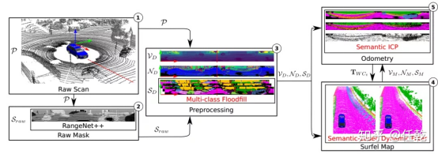
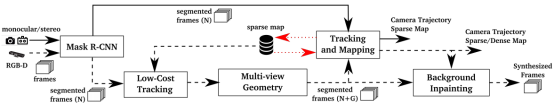
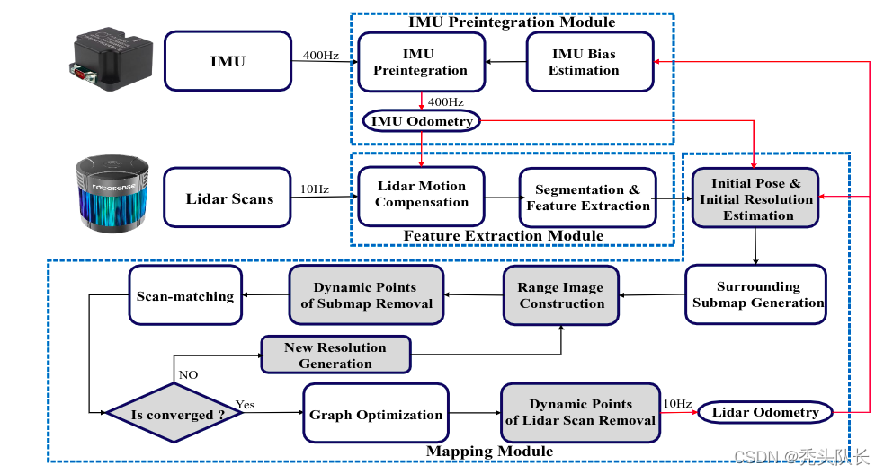

tags:: #毕业设计 #SLAM

- # 国内外研究现状(开题报告部分)
  collapsed:: true
  由于场景中运动物体的存在，传统的SLAM方法会导致数据关联发生错误以及姿态估计出现偏差，进而会影响SLAM系统的整体精度和鲁棒性。因此如何在高速运动场景中实现鲁棒地位姿估计和精准地地图构建是研究的热点。
	- **早期的SLAM研究**
		- Chieh-Chih Wang等人便是利用带运动目标检测与跟踪的贝叶斯公式来检测动态物体，并使用该模型预测未来的运动[1]。对于相对较高频率移动的高动态对象，通过该模型获得的结果通常是可靠的。然而在低动态环境中，其效果并不理想。一些研究者选择使用延迟映射和跟踪的方法来处理半动态的情况，然而这类算法的时间成本普遍较高[2]。
		- P. Egger提出了一种用于长期定位的点云地图表示，即PoseMap，保证了在机器人动态环境中可靠地长期定位，这种新型地图表示方法能够在线更新和扩展地图[3]。
		- Emanuele Palazzolo提出了基于TSDF(Truncated Signed Distance Field)地图的SLAM算法，利用由重投影所获得的残差，并结合环境中自由空间的显式建模表示来检测运动[4]。
	- **深度学习**
		- **SuMa++**基于 SuMa(Surfel Mapping) 框架，利用RangeNet++对点云进行语义分割，并结合每帧点云中的语义标签构建全局语义地图，可靠地滤除场景中的动态物体，并通过构建和带有语义约束的ICP模型，提高定位的稳定性，同时对点云中的动态物体进行了识别并剔除，提高了地图的质量[5]。 
		- **LIOM**同样通过CNN分割网络在每帧激光测量中移除了动态物体，从而避免了对定位和建图的影响[6]。
		- 在**4-D SLAM**方法中，Z. Wang等人采用模糊神经网络检测潜在的运动目标，并通过UKF跟踪器进一步确认潜在运动目标的状态[7]。同时，将静态背景点云应用于标准SLAM，解决了动态环境下SLAM的不一致问题。
	-
	- **优化识别速度**
	  由于将神经网络融合进SLAM后导致系统难以实时运行，并且分割精度与准确度通常和计算时间成反比。
		- Yubao Liu等人提出只在关键帧中进行语义分割，并根据分割结果更新特征点的运动概率，从而减少了计算量同时保证SLAM的精度。此外，还通过对关键帧提取方案的语义延时进行了详细分析和对比，并给出了一种新的关键帧提取策略，能够适用于多种速率的分割网络，最大限度的降低语义延迟、提高挖掘语义信息的潜力[8]。
		- LIDAR-MOS[9]引入深度图来表述LiDAR数据，并采用CNN进行基于深度图的动态物体分割，最终通过投影关系得到每个点的动态或静态标签，最终将场景分割为动态部分和静态部分。相比SuMa++，该算法避免了对场景进行全类别语义分割，从而提高了运算速度，保证算法的实时性。
	- **融合多种识别算法**
		- B. Bescos等人提出结合语义分割网络和多视图几何一致性验证的方法滤除场景中的动态物体，如图2-2所示，一方面利用Mask R-CNN网络对RGB-D获取的图像进行语义分割，并滤除会动的物体；另一方面，通过多视图几何方法滤除正在移动的物体[10]。 
		- Martin Rünz等人则提出基于条件随机场的运动分割与语义分割相结合，更为准确地滤除环境中的动态物体[11]。
- # 动态环境SLAM问题
  id:: 626ca8ec-72a3-420a-9bcc-2e6aba0932d3
	- ## 问题所在
		- **配准层面**
			- 配准都是基于静态假设的，理论上动态点一定会影响配准的精度，实际中如果动态点比例过高的话，会造成轨迹精度下降，甚至不排除跑飞的可能。
			- 需要通过实时的方式在配准之前或配准过程中，识别并干掉动态点。
			- 方法：基于深度学习剔除动态物体
			- 本课题目前计划采用[[Cylinder3D]]实现实时过滤动态物体
		- **建图层面**
			- 针对最终生成地图中的“鬼影”，对后续工作的影响
	- ## 动态物体分类
		- 高动态物体
			- 实时移动的物体，如行人、车辆、跑动的宠物...
			- ((626d31d4-a18c-4e71-8776-577b05514e3f))
		- 低动态物体
			- 短暂停留的物体，如站在路边短暂交谈的人...
			- 一次SLAM过程结束后，后处理方式过滤
		- 半静态物体
			- 在一个SLAM周期中不动，但是并非永远不动的物体，如停车场的车辆、堆放的物料
			- 全生命周期建图（life-long mapping, or long-term mapping）
	- ## 滤除动态物体的方法
		- 在线实时滤除
		  id:: 626d31d4-a18c-4e71-8776-577b05514e3f
			- Mapless Online Detection of Dynamic Objects in 3D Lidar
				- 与前一帧对比找距离过大的潜在动态点
				- 在后一帧中验证激光是否穿过，是的话认为是动态点
				- 聚类生长，得到动态聚类
			- Removal-First Tightly-coupled Lidar Inertial Odometry in High Dynamic Environments
				- 精配准迭代过程中，基于初值和多分辨率深度图检测submap中动态点并移除
				- 
		- 后处理方法
			- [[ERASOR]]
				- 本论文也谈到了其他的方法，考虑时间问题，对其他方法不进行研究
		- life-long mapping
			- 略